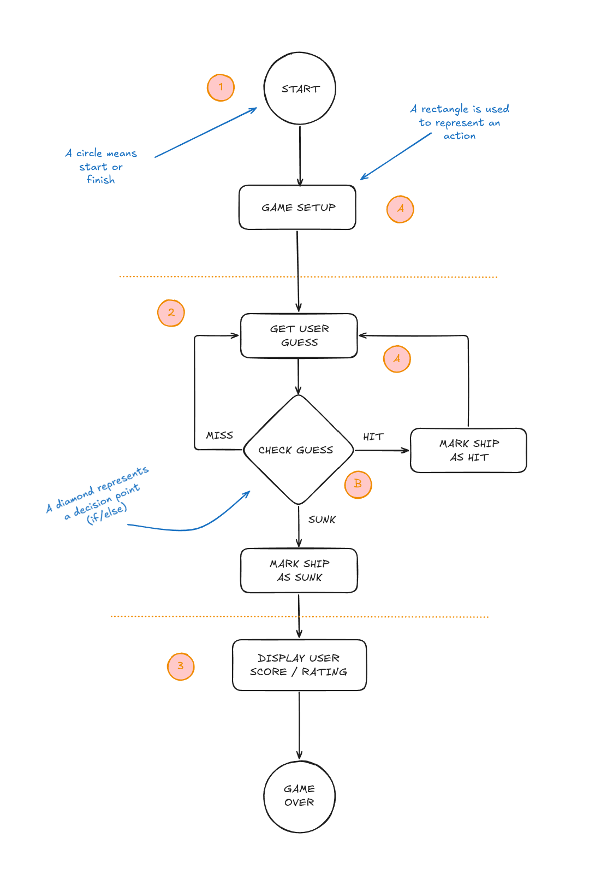

# Goal

Sink the browser's ships in the fewest number of guesses.
You're given a rating, based on how well you perform.

# Setup

When the game program is launched, the computer places ships on a virtual grid.
When that's done, the game asks for your first guess.

# How you play

The browser will prompt you to enter a guess, and you'll type in a grid location.
In response to your guess, you'll see a result of "HIT!", "MISS", or "You sank my battleship!"
When you sink all the ships, the game ends by displaying your rating.

# High level design

1. User starts the game
   A. Game places a battleship at a random location on the grid.
2. Gameplay begins
   - Repeat the following until the battleship is sunk:
     A. Prompt user for a guess ("2","0",etc.)
     B. Check the user's guess against the battleship to look for a hit, miss, or sink.
3. Game finishes
   - Give the user a rating based on the number of guesses it took.

# Flow chart



# Working through the pseudocode

It will help us think through how the program is going to work without having to fully develop the real code.

- DECLARE three _variables_ to hold the locations of each cell of the ship.
- Let's call them _location1, location2, location3_.
- DECLARE a _variable_ to hold the user's current guess. Let's call it _guess_.
- DECLARE a _variable_ to hold the number of hits. We'll call it _hits_ and set it to 0.
- DECLARE a _variable_ to hold the number of guesses. We'll call it _guesses_ and set it to 0.
- DECLARE a _variable_ to keep track whether the ship is sunk or not.
- Let's call it _isSunk_ and set it to false.

```pseudocode
LOOP: while the ship is not sunk
    GET the user's guess
    COMPARE the user's input to valid input values
    IF the user's guess is valid
        TELL user to enter a valid number
    ELSE
        ADD one to guesses
        IF the user's guess matches a location
            ADD one to the number of hits
            IF number of hits is 3
                SET *isSunk* to true
                TELL user "You sank my battleship!"
            END IF
        END IF
    END ELSE
END LOOP
TELL user stats
```

# A round of guesses

| location1 | location 2 | location 3 | guess | guesses | hits | isSunk |
| --------- | ---------- | ---------- | ----- | ------- | ---- | ------ |
| 3         | 4          | 5          | -     | 0       | 0    | false  |
| 3         | 4          | 5          | 1     | 1       | 0    | false  |
| 3         | 4          | 5          | 4     | 2       | 1    | false  |
| 3         | 4          | 5          | 2     | 3       | 0    | false  |
| 3         | 4          | 5          | 3     | 4       | 1    | false  |
| 3         | 4          | 5          | 5     | 5       | 1    | true   |

# But there's a bug! Can you find it?

```javascript
if (guess == location1 || guess == location2 || guess == location3) {
  alert("HIT!");
  hits = hits + 1;
  // you guessed all 3 locations
  if (hits == 3) {
    isSunk = true;
    alert("You sank my battleship!");
  }
} else {
  alert("MISS");
}
```

```javascript
if (guess == location1 || guess == location2 || guess == location3) {
  // Bugfix - previous_guesses var initialised at the top
  // Then we compare to see if the current guess is not equal to the previous guess before doing anything else
  if (guess != previous_guess) {
    alert("HIT!");
    hits = hits + 1;
    previous_guess = guess;
  } else {
    alert("Please guess the next location!");
  }
  // you guessed all 3 locations
  if (hits == 3) {
    isSunk = true;
    alert("You sank my battleship!");
  }
} else {
  alert("MISS");
}
```
